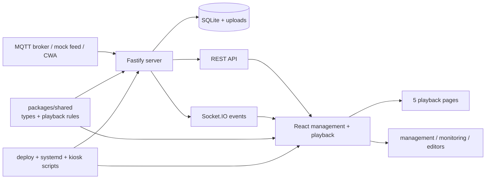

# Solar Player 全專案改善分析與執行路線圖

> 盤點日期：2026-07-13
>
> 分支／基準：`main` / `638b1f0`（2026-07-10）
>
> 範圍：產品與 launch、架構、前後端、測試、安全、效能、資料、部署、可觀測性、UX、文件與 Spectra 流程。

## 1. 結論先行

Solar Player 已不是需要重寫的 prototype。現有 React / Fastify / SQLite / MQTT / Socket.IO 架構與 `packages/shared` 邊界合理，核心 runtime、管理面安全邊界、display readiness、draft/live publishing、fallback、部署 hardening 與回歸測試都已具備。

目前最值得投資的不是換框架或大規模重構，而是把「看似完成、實際仍有洞」的交付鏈收緊：

1. production dependency audit 仍有 4 個漏洞路徑。
2. legacy deploy 預設安裝到 `/opt/solar-display`，但同一流程安裝的 systemd service 從 `/data/solar-display` 啟動。
3. root `pnpm test` 雖通過 1,171 tests，卻漏掉 15 個 server 頂層 tests 與 37 個 deploy tests。
4. runtime export 不是 update deploy 的強制前置，且 archive 包含 `.env`，沒有明確的秘密檔權限與 restore drill。
5. `/docs` 使用的 static OpenAPI 只有 `/health`，與現行 server 大量 API 不相稱。
6. production web build 仍是單一 1,479.70 kB JS chunk（gzip 388.56 kB），Vite 已發出 >500 kB 警告。
7. 五個 playback 頁的 authoritative launch matrix 全部仍是 `blocked`；build/test 綠燈不能代替 fresh runtime/publish/fallback witness。
8. `spectra list --json` 顯示 47 個非 archive changes 全部是 `done`，正式流程入口仍被已完成工作淹沒。

建議先完成 P0 的發布基線，再做 P1 的跨層可靠性；程式碼大型檔案只採 touch-it-then-fix-it，不建立全 repo 500 行硬門檻。

## 2. 本次盤點的假設與限制

- 以目前 checkout、codebase-memory 圖、實際 scripts、Spectra artifacts 與 fresh commands 為準，不把舊 prototype 或聊天記憶當 source of truth。
- working tree 原有 `propose-raw-mqtt-history-persistence` 刪除變更視為使用者工作，本文件不解讀、不修改，也不把該 proposal 當成待辦。
- 本次沒有連線到 production Pi，也沒有可用的 live base URL，因此不宣稱目前部署主機或 FHD 畫面已通過驗收。
- `graphify-out` 現有圖提示使用舊 node-ID scheme，且 skill/package 版本不同；它只作補充導覽。架構與程式判斷以現行檔案和 codebase-memory MCP 為主。
- dependency 漏洞是 2026-07-13 的 `pnpm audit --prod` 快照，需在實作當天重跑。

## 3. 現行架構與責任邊界

### 3.1 已形成的實際模組

| 邊界 | 現況 | 判斷 |
| --- | --- | --- |
| `apps/server` | Fastify routes、SQLite migrations/services、MQTT、Socket.IO、weather、readiness、publishing、device diagnostics | 適合單機 kiosk appliance；不需要改成微服務 |
| `apps/web` | 五個 playback、management routes、editor、API/socket adapters、runtime refresh | 能力完整，但 route modules 仍全部進入單一 production chunk |
| `packages/shared` | 前後端共用型別、playback 與 display contract | code graph 顯示 shared 是高 fan-in core，應維持純、穩定、少副作用 |
| `deploy/` + `scripts/` | bundle、Pi one-key deploy、readonly root、desktop/kiosk、verification | 能力很深，但 legacy `/opt` 與現行 `/data` 路徑仍同時存在 |
| `openspec/` | 47 個 done changes、穩定 specs、archive | 規格資產豐富；主要問題是 archive hygiene，不是缺 spec |

### 3.2 應保留的優勢

- `apps/server/src/plugins/managementAuth.ts` 已把 browser、token、trusted origin 與 Socket.IO session 分成明確 trust classes；不應退回所有 API 公開或單純靠 UI 隱藏。
- MQTT password 對外遮罩、device reboot 預設停用、image delete reference guard、draft optimistic concurrency 都已有測試保護。
- SQLite 已啟用 WAL 與 foreign keys；每個 SQL migration 與 `schema_migrations` 寫入包在同一 transaction。
- display runtime 已有 readiness、rotation plan、skip reason、fallback、publish history、display sync 與 crash recovery，不應另造第二套 runtime。
- playback 五頁已有 editor-backed config 與 shared display primitives；FHD closeout 必須繼續 editor capability-first。
- systemd service 已有 `NoNewPrivileges=true`、`ProtectSystem=strict` 與 bounded `ReadWritePaths`；修路徑時不能削弱 hardening。
- 自動化測試量充足，這次 fresh run 合計驗證 1,223 tests；問題是入口未收齊，而不是完全缺測試。

## 4. 證據基線

### 4.1 Fresh verification

| 指令 | 2026-07-13 結果 | 說明 |
| --- | --- | --- |
| `pnpm test` | pass；server 362 + web 809 = 1,171 | 預設入口仍漏測 |
| server 頂層 5 檔直跑 | 15 pass | `config/env/logger/server-startup/serverRuntimeGuard` |
| `node --test scripts/deploy.test.mjs` | 37 pass | 不在 root test 內 |
| `pnpm build` | pass | Vite 發出單一大 chunk 警告 |
| `pnpm audit --prod` | 4 vulnerabilities：2 high、1 moderate、1 low | 主要是 transitive `ws` 與 `react-router` resolution |
| `pnpm outdated` | all packages up-to-date | direct dependency 最新不代表 transitive audit 已乾淨 |

### 4.2 規模與熱點

- production TypeScript/TSX：約 370 files；test/spec：約 268 files。
- web dist：22 MB。
- production entry JS：1,479.70 kB / gzip 388.56 kB。
- production CSS：229.15 kB / gzip 41.55 kB。
- 最大單一圖片：`factory-bg` 約 5.18 MB；另有多張 1–2.7 MB playback assets。
- code graph 的高責任點包括：
  - `getDatabase` fan-in 96；對 embedded SQLite 合理，但 transaction 與 backup 邊界必須清楚。
  - `requestJson` fan-in 19；它是合理的集中 adapter，不應只因 1,003 行就盲拆。
  - `validateConfigDraft`：129 行、cyclomatic 18、cognitive 44，屬 publishing 高風險純邏輯。
  - `computeDisplayPageAssetHealthReport`：175 行，含 nested scan / repeated membership checks；先量測資料規模再優化。

目前最大的 production files：

| 檔案 | 行數 | 建議 |
| --- | ---: | --- |
| `apps/web/src/pages/DisplayPagesEditor/index.tsx` | 1,441 | 第一重構候選；按 workspace/controller responsibilities 漸進抽離 |
| `apps/web/src/pages/AssetLibrary/index.tsx` | 1,407 | 只在新增流程時抽 upload/selection/details controller，不做純行數重排 |
| `apps/server/src/services/displayStoryService.ts` | 1,309 | 按 page story family 抽純 builder，但保留單一 API contract |
| `apps/server/src/services/displayPagePublishingService.ts` | 1,087 | 優先抽 validation 純模組，保留 transaction/publish ownership |
| `apps/web/src/services/api.ts` | 1,003 | 維持 central adapter；只按穩定 domain exports 切檔 |
| `apps/server/src/mqtt/MqttClientService.ts` | 970 | 低 per-method complexity；不因檔案大就重寫 state machine |

### 4.3 文件與流程真實性

- `docs/openapi.yaml` 自述為 Phase 1 skeleton，只有 `/health`；`apps/server/src/app.ts` 卻以 static mode 把它直接發布到 `/docs`，之後註冊完整 routes。
- `README.md` 描述 deploy/service 使用 `/opt/solar-display`；實際 `deploy/solar-display.service`、Pi scripts 與 `deploy.md` 使用 `/data/solar-display`。
- `deploy/deploy.sh` 預設 `INSTALL_DIR=/opt/solar-display`，但複製的 service 固定 `WorkingDirectory=/data/solar-display`。
- `docs/goal.md` 是空檔，`docs/FHD.01.html` 位於 docs 頂層但不是 source of truth。
- authoritative launch matrix 的五頁、五個 gates 目前全部 `blocked`。
- 47 個非 archive Spectra changes 全部回報 `done`。

## 5. 優先級總覽

| ID | 改善項目 | 優先級 | 影響 | 成本 | 建議形式 |
| --- | --- | --- | --- | --- | --- |
| P0-1 | 修 production dependency 漏洞 | P0 | 安全／可用性 | S–M | 獨立 Spectra change |
| P0-2 | 統一 `/data` deployment contract | P0 | 發布可靠性 | S | 獨立 Spectra change |
| P0-3 | 建立真實 `verify` 入口 | P0 | 測試可信度 | S | 獨立 Spectra change |
| P0-4 | 強制 update 前 backup + restore drill + secret permissions | P0 | 資料安全 | M | 獨立 Spectra change |
| P0-5 | 重跑五頁 launch witness | P0 | 上線判斷 | M | 使用既有 witness workflow |
| P1-1 | 讓 OpenAPI 與 runtime contract 誠實一致 | P1 | API 維護性 | M–L | 分 domain changes |
| P1-2 | 補 3–4 條跨層 browser smoke journeys | P1 | 整合可靠性 | M | 小型 Playwright harness |
| P1-3 | route-level code splitting + playback prefetch | P1 | 首載／恢復速度 | M | 有 performance budget 的 change |
| P1-4 | 對齊 journald、Device Status log export 與 release identity | P1 | 可觀測性 | M | 獨立 change |
| P1-5 | 驗證上傳內容，不只看副檔名 | P1 | 安全／播放穩定 | S–M | 獨立 change |
| P1-6 | 明文化 network exposure / management trust 邊界 | P1 | 安全 | S–M | 部署 gate；必要時再改 auth |
| P1-7 | 核可後歸檔 47 個 done changes | P1 | 流程清晰度 | M | 專門清理 session |
| P2-1 | 高責任熱點漸進模組化 | P2 | 維護性 | L | touch-it-then-fix-it |
| P2-2 | 對高成本資料掃描建立 benchmark / budget | P2 | 效能可預測性 | S–M | 先測後改 |
| P2-3 | 移除 manifest 的 `latest` 意圖模糊 | P2 | 可重現升級 | S | dependency policy change |
| P2-4 | 管理面 keyboard/focus/accessibility audit | P2 | 操作品質 | M | 逐 surface 修 |
| P2-5 | 清理 root docs 誘餌與已知漂移 | P2 | onboarding | S | docs-only change |
| P3-1 | 在 `pnpm verify` 穩定後再接最小 CI | P3 | 持續驗證 | S–M | 有 Git host 時才做 |

## 6. P0：先修發布基線

### P0-1 修 production dependency 漏洞

**證據**

- `ws@8.18.3` 由 Socket.IO / Engine.IO 路徑帶入，audit 命中 high 與 moderate advisories。
- `ws@8.20.1` 由 MQTT 帶入，仍低於 high advisory 的 patched version。
- `react-router@7.15.0` 命中 low advisory。
- `pnpm outdated` 對 direct dependencies 回報已最新，因此只改 `package.json` 的 `latest` 不足以證明修復。

**最小改善**

1. 先更新 lock resolution；若 direct parent 的 semver 無法帶到 patched transitive version，再評估 scoped `pnpm.overrides`。
2. 不升級無關 major、不順便重排 lockfile。
3. 對 Socket.IO connection/reconnect、MQTT connect/publish、router loaders 跑 targeted tests，再跑全量 verification。

**驗收**

- `pnpm audit --prod` 不再有 high / moderate / low known vulnerabilities。
- `pnpm why ws -r` 與 `pnpm why react-router -r` 只顯示 patched versions。
- 既有 MQTT、Socket.IO、router 與全量 build/test 通過。

### P0-2 統一 deployment install root

**證據**

- `deploy/deploy.sh:8` 預設 `/opt/solar-display`。
- `deploy/solar-display.service:14-18` 固定 `/data/solar-display`。
- Pi one-key、readonly root、verify scripts 與現行 handoff 都以 `/data/solar-display` 為唯一 writable runtime boundary。

**建議決策**

以 `/data/solar-display` 為現行單一 contract。若 `deploy/deploy.sh` 仍要支援 generic Linux，可讓 installer 依 `INSTALL_DIR` 產生 service，而不是複製 hardcoded unit；若它已是 legacy，就從正式入口移除並明確標示，不維護兩套互斥預設。

**驗收**

- dry-run／temp-root 測試證明 install dir、`WorkingDirectory`、`EnvironmentFile`、`ReadWritePaths` 完全一致。
- update 不覆蓋 `.env`、`data/`、`logs/`、`uploads/`。
- `systemd-analyze verify`（Linux host）通過，service health 與 kiosk verify 通過。
- README、`docs/ops/conventions.md`、`deploy.md` 與 scripts 只描述同一正式路徑。

### P0-3 建立可信的 `pnpm verify`

**證據**

- root test 的 server glob 漏掉 5 個頂層 test files，共 15 tests。
- deploy tests 共 37 tests，不在 root test。
- 現在「跑 `pnpm test` 綠燈」與「所有既有測試都有跑」不是同一件事。

**最小改善**

1. 先根治 server test discovery；可先驗證 quoted glob，若 runner 行為不穩定，就像 web 一樣用小型 test discovery script 明確列檔。
2. 新增 root `verify`：build、完整 server tests、web tests、deploy tests。
3. 保留 `test` 作快速迴圈或直接讓它呼叫完整 tests；名稱必須與實際覆蓋相符。

**驗收**

- 一個 root command fresh run 到 377 server + 809 web + 37 deploy = 1,223 tests。
- test output 可證明五個 server 頂層 files 被執行。
- 故意讓其中一個頂層 test fail 時，root command 必須非零退出。
- 修好後同步移除 `docs/ops` 中已不再需要的手動繞路條款。

### P0-4 把 backup / restore 納入 update contract

**證據**

- `migrateDatabase()` 在啟動時自動套用尚未執行的 migrations。
- `deploy/export-runtime-state.sh` 能打包 `data`、uploads 與 `.env`，但只警告 service 正在執行，不是 update 的強制前置。
- one-key deploy 沒有呼叫 runtime export。
- archive 與 `.env` 可能包含 MQTT password、management token；目前 installer 沒有明確 `0600` gate。

**最小改善**

1. update deploy 前停止 service 或使用 SQLite backup API / checkpoint-safe snapshot。
2. 產生 timestamped、`0600` 的 runtime archive，記錄 app commit、schema versions、hash 與包含項目。
3. 部署失敗時保留上一版 app bundle與 restore command，不自動破壞新資料。
4. 在 temp dir 做 restore drill：解包、開 DB、跑 migrations、`PRAGMA integrity_check`、啟動 health smoke。
5. installer 對 `.env` 與包含 `.env` 的 exports 強制 owner-only permissions。

**驗收**

- update script 沒有可驗證 backup 就 fail closed。
- restore drill 在新 temp root 成功，DB integrity 為 `ok`。
- archive 不會被一般使用者讀取，文件清楚標示含 secrets。
- 現有 readonly root 與 `/data` writable boundary 不被破壞。

### P0-5 取得 fresh launch truth

**證據**

- `docs/reference-match/display-launch-witness-matrix.md` 五頁的 authoring、runtime parity、publish refresh、fallback、handoff 全部是 `blocked`。
- 現有視覺 closeout 紀錄多為 2026-06-05/06；不能代表 2026-07-13 runtime。

**執行**

1. 啟動乾淨 local runtime，固定 test DB / assets / MQTT mock fixture。
2. 跑 `pnpm run fhd:witness -- --base-url <url> --run-id <id>`。
3. 每頁實際走 editor → draft → publish → playback refresh → missing data/media fallback。
4. 按 `docs/fhd-witness/evidence-template.md` 產 evidence bundle，回填 authoritative matrix。
5. intentional difference 與 launch acceptance 交由使用者判定。

**驗收**

- 五頁各 gate 有 fresh pass/fail/blocker，不留推測性 `blocked`。
- 每頁都有 reference pair、editor screenshot、runtime screenshot、gap notes 與 handoff。
- 不能用自動 pixel threshold 取代 human acceptance。

## 7. P1：補齊跨層可靠性

### P1-1 讓 API 文件與 runtime contract 誠實一致

**問題**

static OpenAPI 只列 `/health`，但 app 在 Swagger 後註冊約二十個 route modules，code graph 記錄 128 個 Route nodes。使用者看到 `/docs` 會合理地誤以為它是完整 contract。

**建議**

- 短期：README 與 `/docs` 明確標示 health-only / partial，避免 false authority。
- 中期：按 domain 補 route schemas，優先順序為 playback/runtime bootstrap、display draft/live/publish、MQTT settings、assets、device/readiness。
- 不做全站 response envelope 大爆改。對既有不一致 response shape，先在 web adapter 與 route schema 固定，再逐 domain 收斂。
- 新增 contract coverage test：critical route path / method / auth class / success shape / error shape 必須存在於規格。

**驗收**

- `/docs` 不再自稱完整但只顯示 `/health`。
- critical web API functions 有對應 server route 與 schema。
- generated/static spec 的 critical paths 與 route inventory test 一致。

### P1-2 補少量跨層 browser smoke

現有 server integration 與 web unit/source tests 很多，但 repo 明確沒有 e2e。最有 ROI 的不是建立龐大 e2e suite，而是利用已安裝的 Playwright，鎖住跨 REST、Socket.IO、DB 與 router 的關鍵 journeys：

1. editor 修改 draft → version conflict → publish → playback 收到 refresh。
2. image upload → playlist governance → images playback → missing asset fallback。
3. MQTT mock/mqtt mode 切換 → readiness/rotation skip reason → live metric refresh。
4. app reload / chunk failure / Socket reconnect 後，playback 不空白且能繼續輪播。

**驗收**

- 使用 temp DB、temp uploads、固定 port，測試可重跑且不碰 production data。
- 每條 journey 只驗 observable contract，不做脆弱的整頁 DOM snapshot。
- browser smoke 失敗時保留 screenshot、console、network 與 server log evidence。

### P1-3 route-level code splitting 與 playback-aware prefetch

**證據**

- `router.tsx` 靜態 import 所有 playback 與 management routes。
- production build 只有一個 1.48 MB JS entry，Vite 明確警告 chunk >500 kB。
- repo 已有 staged loaders、warm config cache、first-paint guards；code splitting 不能破壞這些行為。

**最小改善**

1. 先把 management-only routes lazy load，降低 kiosk playback 初載，不動 runtime contract。
2. playback templates 可拆成 route chunks，但播放控制器要 prefetch 下一個 effective rotation page，避免輪播時才抖動載入。
3. dev-only `react-grab` 繼續維持 production alias 邊界。
4. 大型 PNG 只在對應 route 使用；優先轉換不需透明度的大圖為 WebP/AVIF，保留 FHD witness。

**效能 budget**

- initial entry gzip 至少下降 25%，且不增加 first visible route 的 blank/loading phase。
- production build 產生可辨識 route chunks，不再只有單一大 JS chunk。
- 五頁 rotation 在 cold/warm cache 都無空白 frame；FHD geometry 與 asset quality 不退化。

### P1-4 對齊真實日誌來源與 release identity

**證據**

- production logger 寫 stdout，systemd 收到 journald。
- `/api/device/logs` 與 export route 卻掃 `LOG_DIR/*.log`。
- service 雖建立 writable logs dir，但 app 沒有 production file sink；Device Status 可能顯示空目錄，而真實錯誤在 journal。
- health/device status 沒有目前 app commit 或 release id，現場難以確認跑的是哪一版。

**建議**

- 決定單一 truth：優先以 journald 為 server log source；若必須在 `/data` 永久保存，則建立 bounded rotation 的單一 file sink，不能兩邊無限複製。
- Device Status 回報 `source`、可讀範圍、retention 與 unavailable reason，不把「空陣列」誤當「沒有錯誤」。
- build/deploy 產生 release manifest：commit、build time、schema max version、package version；在 device status 顯示。

**驗收**

- 注入一次 server error 後，operator 能從 Device Status 或明確 runbook 取得同一筆 evidence。
- logs 有大小／天數上限，readonly root 下仍可寫且重開機後行為明確。
- `/health` 維持便宜 liveness；深度資訊留在受保護的 device/diagnostics API。

### P1-5 驗證 image bytes，不只驗 filename

**證據**

upload route 有 10 MB 與副檔名限制，但目前直接把 buffer 寫入磁碟，DB 的 `mime_type` 來自 multipart metadata，沒有檢查 magic bytes 或實際可解碼性。

**最小改善**

- 驗證 PNG/JPEG/WebP signature，並嘗試讀取 dimensions；副檔名、declared MIME 與 detected type 不一致時拒絕。
- 設合理 pixel dimension / decompression bomb 上限，不只看壓縮檔大小。
- 寫檔與 DB insert 仍維持失敗清理；不要為此導入完整 media pipeline。

**驗收**

- renamed text/binary、truncated image、超大 dimensions 被拒絕。
- 既有合法 PNG/JPEG/WebP 與 10 MB 邊界 tests 通過。
- error 不回傳 server path 或 buffer 內容。

### P1-6 明文化 network exposure / management trust 邊界

**證據**

- server 預設 bind `0.0.0.0`，現行部署也會從 LAN / Tailscale 存取。
- management auth 會信任 loopback、configured origin 與 same-host browser origin；`MANAGEMENT_ACCESS_TOKEN` 是額外通道，不會自動把 same-host browser 轉成 token-required。
- 這適合受控 kiosk / trusted network，但不等於能安全公開到 Internet 或 guest LAN。

**最小改善**

1. 先把 production threat profile 寫清楚：允許的 interface、subnet、Tailscale ACL、是否有 reverse proxy；不要先發明複雜的 account system。
2. 讓 deploy verification 檢查 port 3000 沒有暴露到未授權 interface，並確認 firewall / ACL 的實際狀態。
3. 若需求包含 guest LAN 或 Internet，再獨立設計 strict management mode：same-origin 也必須有 credential，REST 與 Socket.IO 使用同一判定。
4. 不把「隱藏 management route」當 authorization。

**驗收**

- deployment runbook 能回答誰可連 port 3000、誰可 mutate、credential 在哪一層驗證。
- 從允許與不允許的 network path 各做一次實測；不允許路徑 fail closed。
- 若啟用 strict mode，無 credential 的 same-origin REST / Socket management session 都被拒絕，playback-safe bootstrap 仍可用。

### P1-7 清理 47 個 done Spectra changes

這是流程債，不是 runtime bug；依 repo 規則，批次 archive 前必須先取得使用者核可。

**執行方式**

1. 產出 47 個 change 的 tasks 完成度、implementation presence、spec drift 與 archive readiness 清單。
2. 把「done 但缺驗證／缺 artifact」與「可直接 archive」分開。
3. 使用者核可名單後逐一 archive，每個 change 立即 validate，不在最後一次驗全部。
4. 完成後 `spectra list` 只保留真正進行中 changes。

## 8. P2：演進式品質改善

### P2-1 只重構高責任熱點

不設定硬性 `<500 lines`。目前大型檔案中，tests、adapter、state machine 與集中 schema 的拆分收益不同；用行數一刀切會產生 import churn，卻不一定降低風險。

推薦順序：

1. `DisplayPagesEditor/index.tsx`：把 workspace shell、selected page/session orchestration、publish status 與 panel composition 抽成有行為測試的 controllers/hooks。
2. `displayPagePublishingService.ts`：把 geometry、media treatment、card rail、freeform object validation 拆成純 validation modules；transaction/publish/rollback 留在 service。
3. `displayStoryService.ts`：按 page family 抽純 story builders，共用 provenance/metric helpers，route contract 不變。
4. `AssetLibrary/index.tsx`：只在修改 upload、selection、metadata 或 reference triage 時抽相應責任。

每個 refactor 的驗收是同 fixture 前後輸出一致、現有 tests 通過、沒有新增 public abstraction；不能用「檔案變短」當完成證據。

### P2-2 對資料掃描建立量測門檻

`validateConfigDraft` 有區域 overlap O(n²) scan；`computeDisplayPageAssetHealthReport` 有 nested references 與 repeated `includes/some`。目前 display regions / assets 通常不大，直接優化可能得不償失。

先新增 realistic fixtures（例如 5/25/100 pages、100/1,000 assets）與 timing/query-count baseline。只有超過 operator 可感知門檻時才改成 Set/Map、批次 lookup 或索引；改後必須保留 finding ordering 與 message contract。

### P2-3 讓 dependency intent 可重現

多數 direct dependencies 使用 `latest`。lockfile 能固定目前 install，但 manifest 無法表達允許的 major，下一次 lock refresh 可能一次跨越多個 majors。

建議把 production 與 toolchain dependencies 固定在已驗證 major/minor range，升級採小批次：runtime、build tool、types 分開；每批跑 audit、build、tests 與必要 witness。不要在漏洞修復 change 同時做全套 major upgrade。

### P2-4 管理面 accessibility audit

目前 editor、Asset Library、MQTT 已有部分 `aria-pressed`、tabs、status 與 keyboard handlers，並非零基礎。改善應鎖定：

- tablist 的 Arrow/Home/End keyboard semantics，而不只是 `role=tab`。
- modal/drawer focus trap、Escape、關閉後 focus restore。
- canvas objects 與 resize handles 的可理解 label、keyboard alternative。
- async save/test/publish 的 `aria-live` 與 error focus。
- 色彩之外的 connected/warning/error state indicator。

逐 surface 用 keyboard-only witness 與 browser accessibility tree 檢查，不對 playback decorative canvas 套用 management form 規則。

### P2-5 文件與 entrypoint hygiene

- 修正 README 與 conventions 的 deploy path；不要讓文件繼續描述不存在的 `/opt` service contract。
- OpenAPI 收斂前，把 Phase 1 skeleton 與 health-only 範圍說清楚。
- 刪除空的 `docs/goal.md`，或填入真實且有 owner 的目標；空檔只會誤導 agent。
- 將 `docs/FHD.01.html` 移入 archive 或加入顯眼 historical-only header；`docs/reference/FHD/` PNG 仍是 visual source of truth。
- docs snapshot facts 要附日期；一旦 runtime/scripts 改變，同 change 同步更新與回收 workaround。

## 9. P3：可選的最小 CI

repo 目前沒有 `.github/workflows`，也沒有 lint、coverage、e2e 或 CI policy。先讓本機 `pnpm verify` 成為可信單一入口；只有 repo 確實透過 Git host 協作時，再加一個最小 workflow 呼叫同一 command。

不要同時導入 lint、formatter、coverage threshold、matrix builds 與 release automation。第一版 CI 只需：固定 Node/pnpm、frozen lockfile install、`pnpm verify`、保留失敗 artifacts。FHD human acceptance 不應被假 pixel gate 取代。

## 10. 建議執行順序

### Phase A：0–2 天，修會造成假成功或部署失敗的問題

1. `remediate-production-dependency-advisories`
2. `repair-deploy-install-root-contract`
3. `close-test-entrypoint-coverage`
4. 同步 README / conventions 的直接 drift

完成條件：audit 乾淨、單一 deploy root、root verify 跑到 1,223 tests、build 通過。

### Phase B：接著保護 production state

1. `protect-runtime-backup-and-restore`
2. `align-device-log-source-and-release-identity`
3. 明確記錄並驗證 production network exposure boundary
4. 在 temp root 與一台非 production Pi 做 install/update/rollback rehearsal

完成條件：可驗證 backup、restore drill、service health、kiosk verify、logs/release 可辨識。

### Phase C：補跨層 contracts 與效能

1. `add-critical-browser-smoke-journeys`
2. `align-critical-openapi-runtime-contracts`
3. `split-web-route-bundles-with-playback-prefetch`
4. `harden-image-upload-content-validation`

完成條件：critical journeys 穩定、API 文件不再誤導、entry chunk 達 budget、輪播無 blank frame。

### Phase D：用 fresh evidence 收 launch

1. 先跑五頁 baseline witness。
2. 依每頁 actual gap 各開小 change；editor capability-first。
3. runtime parity、publish refresh、fallback、handoff 逐 gate 回填。
4. 使用者判定 intentional differences 與 launch acceptance。

### 平行的治理工作

- 取得核可後，專門清理 47 個 done changes。
- 高責任檔只在碰到相應功能時漸進抽離，不啟動 repo-wide refactor。

## 11. 不建議做的事

- 不重寫成 Rust backend、微服務、Redux 或另一套資料庫；目前證據不支持這些成本。
- 不把 `getDatabase()` 改成全 repo dependency injection 只為了「架構漂亮」。
- 不大爆改所有 API response envelope；先固定 critical contracts。
- 不訂全 repo 500 行硬門檻，也不為達行數切出沒有責任邊界的 files。
- 不用 page-local hardcode 修 FHD；editor 表達不了就先擴 editor capability。
- 不讓 route code splitting 犧牲 playback first paint 或 rotation continuity。
- 不把 FHD screenshot command、build 綠燈或 pixel diff 當 launch acceptance。
- 不在 production state backup 未驗證前執行 schema-changing deploy。

## 12. 完成判準

這份 roadmap 可視為完成，不是因為所有建議都實作，而是因為後續每一項都有可判定的 exit criteria。整體產品 launch-ready 的最低條件為：

1. production audit 無 known vulnerabilities。
2. install/update/rollback 使用同一 runtime root，backup/restore drill 通過。
3. 單一 root verification command 跑到所有既有 tests，build 綠燈。
4. critical API / Socket / DB browser journeys 有 fresh evidence。
5. authoritative launch matrix 的五頁各 gate 都有 fresh pass/fail/blocker。
6. 使用者完成 intentional difference 與 launch acceptance 判定。
7. `spectra list` 不再被已完成未歸檔 changes 淹沒。

## 13. 本次使用的主要證據

- `AGENTS.md`
- `README.md`
- `package.json`
- `apps/server/package.json`
- `apps/web/package.json`
- `apps/server/src/app.ts`
- `apps/server/src/plugins/managementAuth.ts`
- `apps/server/src/db/index.ts`
- `apps/server/src/db/migrate.ts`
- `apps/server/src/routes/images.ts`
- `apps/server/src/routes/device.ts`
- `apps/server/src/services/displayPagePublishingService.ts`
- `apps/server/src/services/displayPageAssetService.ts`
- `apps/web/src/app/router.tsx`
- `apps/web/src/services/api.ts`
- `apps/web/vite.config.ts`
- `deploy/deploy.sh`
- `deploy/solar-display.service`
- `deploy/export-runtime-state.sh`
- `deploy.md`
- `docs/openapi.yaml`
- `docs/ops/conventions.md`
- `docs/ops/diagnosis.md`
- `docs/ops/fhd-closeout.md`
- `docs/ops/judgment.md`
- `docs/ops/letter.md`
- `docs/fhd-witness/playback-closeout-matrix.md`
- `docs/reference-match/display-launch-witness-matrix.md`
- `openspec/specs/` 與 `spectra list --json`
